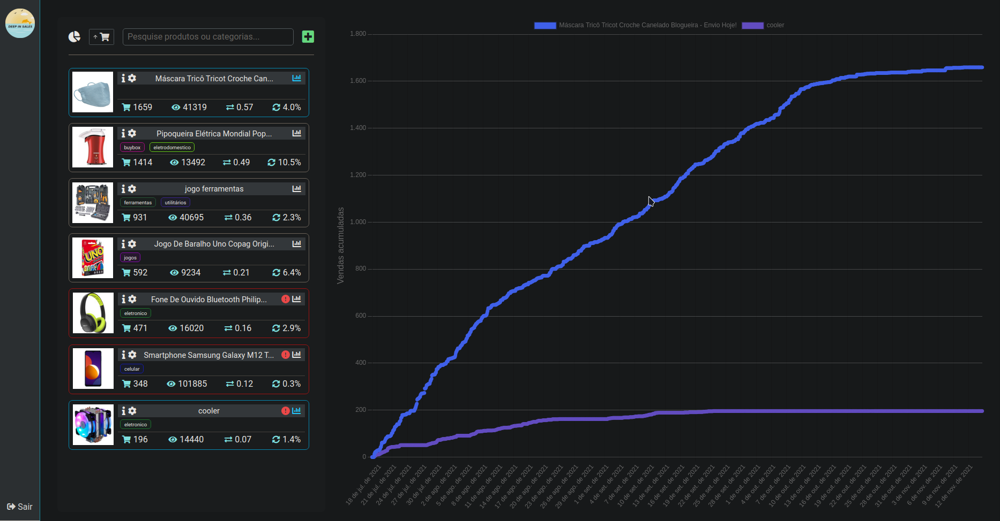

# Deepinsales
## Introduction
Web app made in my free time to both test and improve my skills, and also to help friends to be more sucessfull while selling products on a brazilian marketplace.\
The goal of the app is to keep track of sells and views of any ad page saved by the user. The current version of the app only accepts ads from Mercado Livre, but could be expanded in the future.\
 
Here is a screenshot of the user's dashboard:\
 

## Stack
- Frontend: React + Redux
- Backend: NodeJS + Express + Sequelize (ORM)
- Database: PostgreSQL
- Hosting: Linux VM with Nginx and PM2, configured by me and deployed at DigitalOcean

## Features
- Basic authentication
- Data fetching from the plataform API
- Webscrapper to get sells data (not available in the plataform API)
- Scheduler to trigger scrapper and API token refresh

## Project status
The app was shutdown because of eventual lack of usage by my friends and difficulty to maintain and expand by myself.\
Still, the main purposes of this project was to learn and have fun, and this was accomplished with success :)
